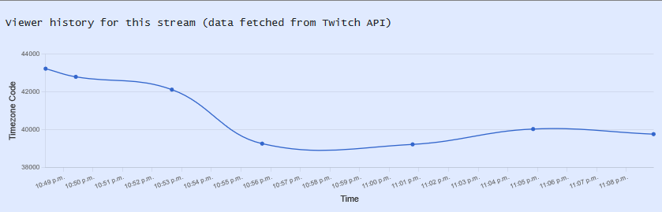

Jacob Smith, Christopher Tam, Nicolas Ramirez
Cosi 166B
4/7/21

GitHub link: https://github.com/Ladder-Gaming-Network/rails_model

Heroku: https://ladder-gaming.herokuapp.com/

**_/prototypes contains paper prototypes for the final stage of this project!_**

# Current functionality

**Our rails app has progressed from stage 2 to include profile viewing, authentication, and prototypes of Twitch API integration. Users can now register for a Ladder account, log in, view their profile, and follow other users' profiles. The profile now contains more database information, a feed of followed users' posts, as well as a sample Twitch embed and view count tracker using the Chartkick and Twitch-API gems.**

Our main view is the welcome page. This view contains a “carousel” like implementation for the first part of the page. This carousel rotates and displays different images and tag lines. At the top of our application is the navbar. The navbar includes all the different tabs such as “Profile” and also implements a search functionality. The search bar allows users to find and connect with other users on the platform. Our profile view consists of a profile picture, live stream API, description and basic information such as name and timezone. Additionally, you can view your post “feed” in the profile view of our page. The profile view also displays followers and following information.

Currently, new users fill out a form where they provide the information required for a profile. This form is processed and creates the user profile. Another time users interact with forms is with the post mechanism. The form first validates a user id (meaning the user is logged in) and text (not a blank post). After this form is processed, the corresponding followers can then view the post in the “feed” section of the profile.

# URL Routes

Home page: /
Search form: /search
Display user login prompt, and check for correct password: /login
Logout: /logout (which redirects to home page)
Admin view: /admin

Users: /users
/users/new
/users/create
/users/delete
/users/1

Posts: /posts
/posts/new
/posts/create
/posts/delete
/posts/1

Followers: /follows
...

Streams: /streams
...

Viewcounts: /follows
...

# Database schema

Our models currently consist of user, follows, post, streams, and viewcounts. The user model has a has_many relationship with posts and following. The user model also consists of a name, description and timezone. The timezone is used to make appropriate recommendations to users. For example, people in Europe will receive slightly different recommendations to those in the U.S. A post belongs_to a user, each post validates the user id and that there is text in the post. The post functionality is part of the “twitter” part of our application. The follows model is used to keep track of who the user is following. In other words, who’s posts the user wants to see. Streams and viewcounts are used to display Twitch data, which our live charting is reliant on.

Name: User

- string username, string firstname, string lastname, integer timezone_code, string stream_link, String description

Name: Stream

- string title, integer user_id

Name: Viewcount

- integer viewers, integer stream_id

Name: Posts

- integer user_id, string text, int parent_post id (0 if no parent)

Name: Follows

- integer gamer\_ id, integer follower_id (which is a gamer_id)

Associations

User -> Posts (Posts) **_(One to Many)_**

User -> User (Follows) **_(Many to Many)_**

User -> User (Followers) **_(Many to Many)_**

User -> Stream **_(One to Many)_**

Stream -> Viewcount **_(One to Many)_**

# Planned views

Separate stream and feed in profile to /profile/stream and /profile/feed.
Ability to edit profile in /profile/edit
Ability to add posts with embedded media in /posts/create
Add news recommender to /news

# Current Dependencies

**_Bootstrap_** for website layout
**_Faker_** gem for initial seeding
**_RailsAdmin_** gem for admin console
**_Chartkick_** gem for live viewcount charting
**_Twitch-api_** gem for viewcount sampling

